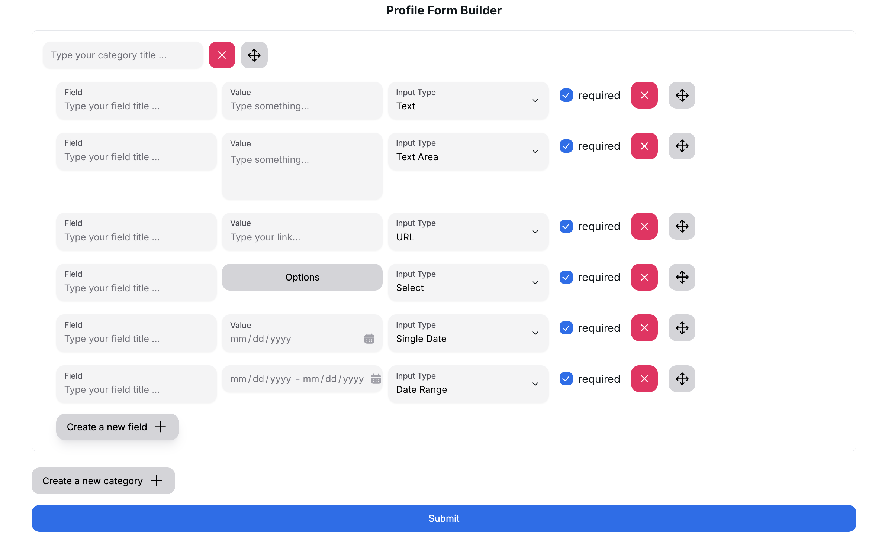
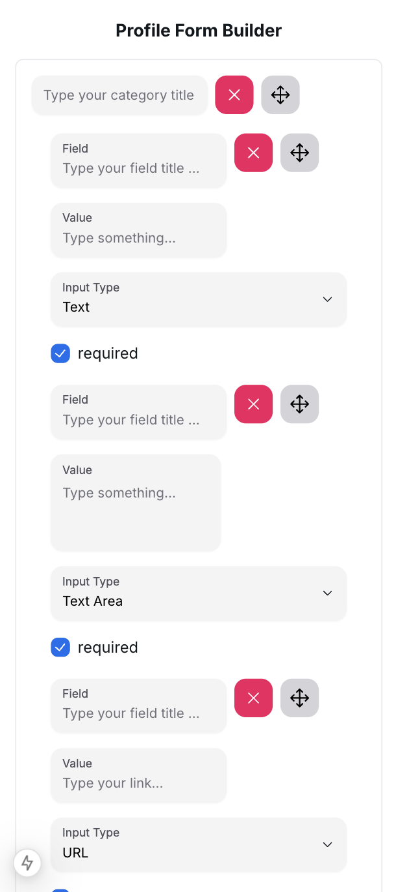

# Dynamic Form: Nested Profile Builder Documentation

## Overview

This document provides a comprehensive guide to implementing a dynamic, nested profile builder form. The form includes functionality for adding, removing, and reordering fields dynamically. It is built using React Hook Form, Zod for validation, and React Beautiful DnD for drag-and-drop reordering. Styling ensures responsiveness and a smooth user experience.

---

## Step 1: Creating Form Components

To build the profile builder, reusable form components such as `Select`, `Input`, `Textarea`, and `DatePicker` were created. These components utilize the `Controller` component from React Hook Form to integrate seamlessly with the form state.

### Example: Form Input Component

```jsx
const FormInput = ({ name, control, ...props }: FormInputProps) => {
  return (
    <Controller
      name={name}
      control={control}
      render={({
        field: { onChange, onBlur, value, ref },
        fieldState: { error, invalid },
      }) => (
        <div>
          <Input
            className="lg:w-[240px]"
            onChange={onChange}
            placeholder="Type something..."
            errorMessage={error?.message}
            {...props}
          />
          <div className="text-red-600 text-sm mt-2 ml-2">{error?.message}</div>
        </div>
      )}
    />
  );
};

export default FormInput;

```

---

## Step 2: Dynamic Adding and Removing Fields

Dynamic fields are managed using `useFieldArray` from React Hook Form. This allows seamless addition and removal of fields while maintaining form state.

### Setting Up the Field Array

The main profile form uses a `useFieldArray` to manage categories dynamically.

```jsx
const { control } = useFormContext();
const { fields, append, remove } = useFieldArray({
  name: 'categories',
  control,
});
```

### Adding and Removing Categories: Example

```jsx
<Button onClick={() => append({ title: '', fields: [] })}>Add Category</Button>

<ul>
  {fields.map((field, index) => (
    <li key={field.id} className="mb-4">
      <Input name={`categories.${index}.title`} control={control} placeholder="Category Title" />
      <Button onClick={() => remove(index)}>Remove</Button>
    </li>
  ))}
</ul>
```

---

## Step 3: Nested Dynamic Fields

Inside each category, additional fields are managed using another `useFieldArray`. A component, `CreateCategoryField`, handles these subfields dynamically.

### CreateNewCategoryField Component: Example

```jsx
const CreateNewCategoryField = ({ categoryIndex, control }) => {
  const { append, remove, fields, move } = useFieldArray({
    name: `category.${categoryIndex}.fields`,
    control,
    shouldUnregister: true,
  });

  return (
    <ul>
      {fields.map((field, index) => (
        <li key={field.id} className="flex gap-2 mb-2">
          <Input
            name={`categories.${categoryIndex}.fields.${index}.name`}
            control={control}
            placeholder="Field Name"
          />
          <Button onClick={() => remove(index)}>Remove</Button>
        </li>
      ))}
      <Button onClick={() => append({ name: '' })}>Add Field</Button>
    </ul>
  );
};
```

---

## Step 4: Form Validation with Zod

Form validation is powered by Zod and integrated with React Hook Form using `zodResolver`. Conditional validation is implemented using a `z.discriminatedUnion` to handle optional and required fields dynamically.

### Zod Schema Example

```jsx
import { z } from 'zod';

const fieldSchema = z.discriminatedUnion('isRequired', [
  z.object({
    isRequired: z.literal(false),
    name: z.string().optional(),
  }),
  z.object({
    isRequired: z.literal(true),
    name: z.string().nonempty('This field is required'),
  }),
]);

const categorySchema = z.object({
  title: z.string().nonempty('Category title is required'),
  fields: z.array(fieldSchema),
});

const profileSchema = z.object({
  categories: z.array(categorySchema),
});
```

---

## Step 5: Reordering Items with React Beautiful DnD

To enable reordering, React Beautiful DnD is combined with the `move` method from `useFieldArray`.

### Drag-and-Drop Context

```jsx
import { DragDropContext, Droppable, Draggable } from 'react-beautiful-dnd';

const handleDragDrop = ({ source, destination }) => {
  if (destination) {
    move(source.index, destination.index);
  }
};

<DragDropContext onDragEnd={handleDragDrop}>
  <Droppable droppableId="categories" direction="vertical">
    {(provided) => (
      <ul ref={provided.innerRef} {...provided.droppableProps}>
        {fields.map((field, index) => (
          <Draggable key={field.id} draggableId={field.id} index={index}>
            {(provided) => (
              <li
                ref={provided.innerRef}
                {...provided.draggableProps}
                {...provided.dragHandleProps}
                className="flex flex-col border p-2 mb-4"
              >
                <Input
                  name={`categories.${index}.title`}
                  control={control}
                  placeholder="Category Title"
                />
                <CreateCategoryField categoryIndex={index} control={control} />
              </li>
            )}
          </Draggable>
        ))}
        {provided.placeholder}
      </ul>
    )}
  </Droppable>
</DragDropContext>;
```

---

## Step 6: Styling Final Nested Form System

These images demonstrate how users can interact with the form, dynamically add/remove fields, reorder items, and submit the form. The form is optimized for both desktop and mobile views.

### Desktop UI



### Mobile UI



---

# Next.js & HeroUI Template

This is a template for creating applications using Next.js 14 (app directory) and HeroUI (v2).

[Try it on CodeSandbox](https://githubbox.com/heroui-inc/heroui/next-app-template)

## Technologies Used

- [Next.js 14](https://nextjs.org/docs/getting-started)
- [HeroUI v2](https://heroui.com/)
- [Tailwind CSS](https://tailwindcss.com/)
- [Tailwind Variants](https://tailwind-variants.org)
- [TypeScript](https://www.typescriptlang.org/)
- [Framer Motion](https://www.framer.com/motion/)
- [next-themes](https://github.com/pacocoursey/next-themes)

## How to Use

### Use the template with create-next-app

To create a new project based on this template using `create-next-app`, run the following command:

```bash
npx create-next-app -e https://github.com/heroui-inc/next-app-template
```

### Install dependencies

You can use one of them `npm`, `yarn`, `pnpm`, `bun`, Example using `npm`:

```bash
npm install
```

### Run the development server

```bash
npm run dev
```

### Setup pnpm (optional)

If you are using `pnpm`, you need to add the following code to your `.npmrc` file:

```bash
public-hoist-pattern[]=*@heroui/*
```

After modifying the `.npmrc` file, you need to run `pnpm install` again to ensure that the dependencies are installed correctly.

## License

Licensed under the [MIT license](https://github.com/heroui-inc/next-app-template/blob/main/LICENSE).
